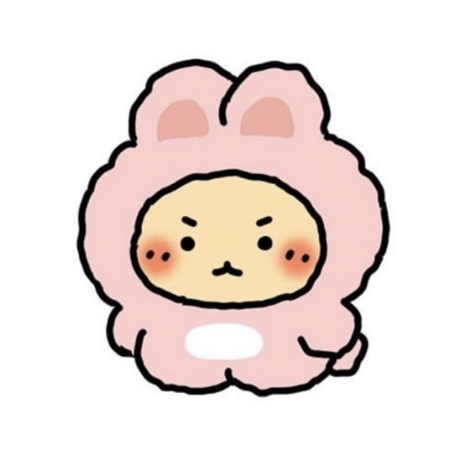
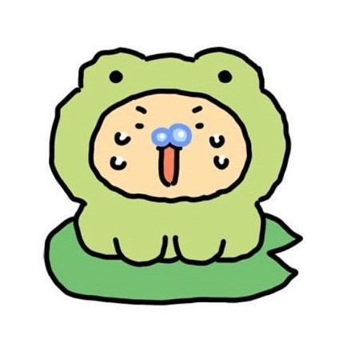

# 🔥 모여서 각자 딥다이브! 
**📚👩‍💻✍ 모각코 모임**

|  |
| ------------------------------------------------------ |

 

## 📌 진행 방식 

- 모각코는 매주 일요일 20시 30분에 진행됩니다.
- 금요일 21시까지 일요일에 할 일과 참여 여부를 구글시트에 작성합니다.
- 일요일
  - 20시 30분~21시 30분 집중 타임 🔥🔥🔥
  - 21시 30분 1차 마무리(원하는 사람은 남아서 진행)
  - 공유하고싶은 내용이 있다면 자율 발표를 진행합니다.
    - 1인 최대 10분 내외, 최대 2명으로 제한합니다.
    - 22시는 넘기지 않도록 주의합니다.
  - 진행한 내용은 이 레포지토리에 공유합니다.
    - 폴더 이름은 `yymmdd` 형식으로 생성합니다. 

 

## 💕 스터디원 

<table>
<tbody>
<tr>
<td align="center"></td>
<td align="center"></td>
<td align="center"></td>
<td align="center"></td>
<td align="center"></td>
<td align="center"></td>
</tr>
<tr>
<th align="center">고석영</th>
<th align="center">권현경</th>
<th align="center">김해리</th>
<th align="center">박결</th>
<th align="center">박다솜</th>
<th align="center">이여진</th>
</tr>
<tr>
<td align="center" width="120"><a href="https://github.com/samseburn">@samseburn</a></td>
<td align="center" width="120"><a href="https://github.com/kwonhygge">@kwonhygge</a></td>
<td align="center" width="120"><a href="https://github.com/frogk">@frogk</a></td>
<td align="center" width="120"><a href="https://github.com/hotdog1004">@hotdog1004</a></td>
<td align="center" width="120"><a href="https://github.com/devsomda">@devsomda</a></td>
<td align="center" width="120"><a href="https://github.com/limejin">@limejin</a></td>
</tr>
</tbody>
</table>

